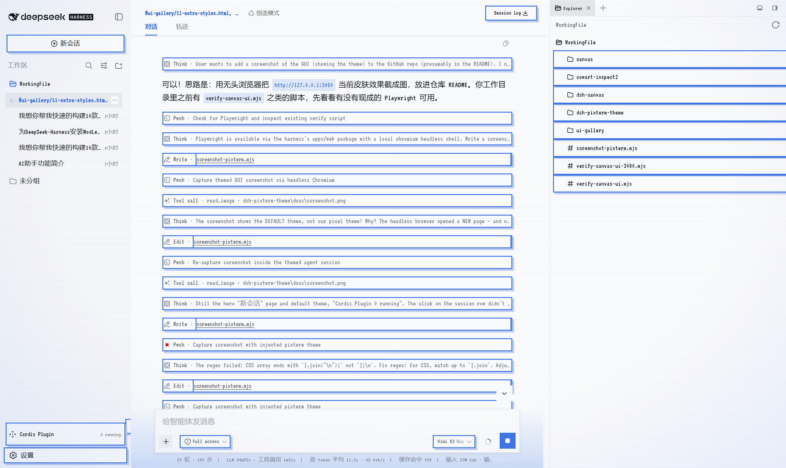
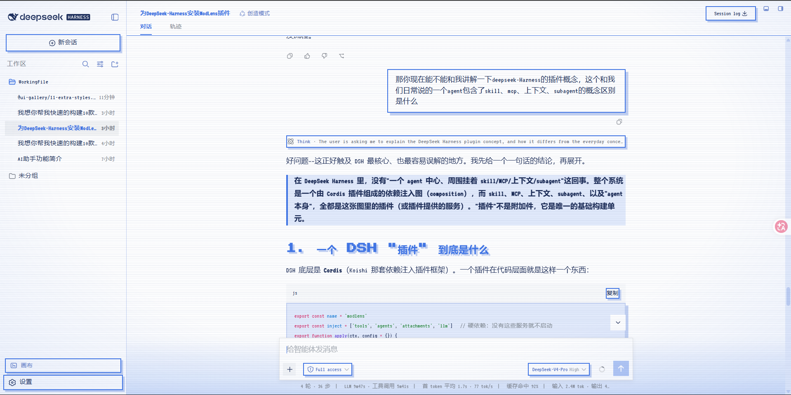
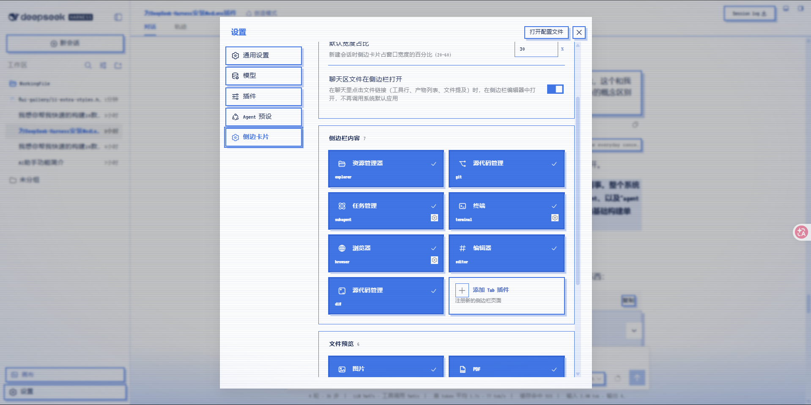
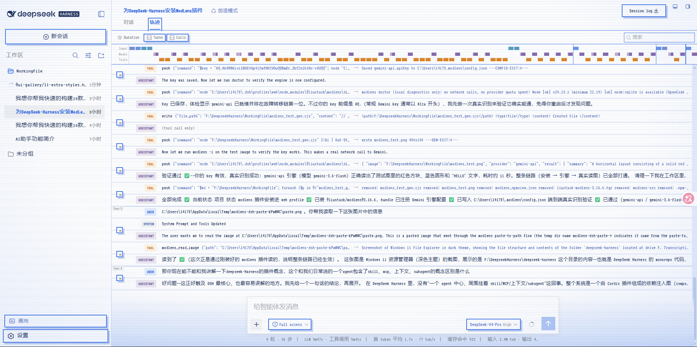
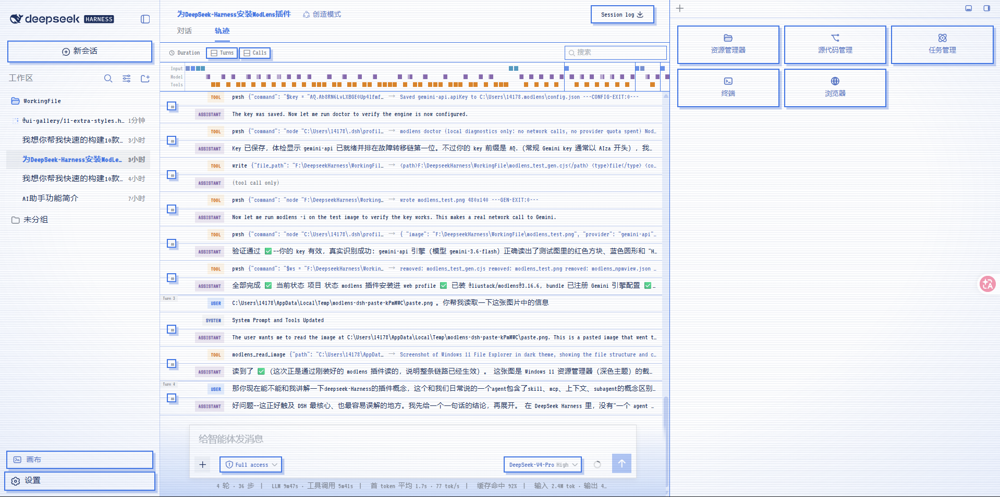

# dsh-pixterm-theme

**Pixel Terminal Blue (Light)** — a complete skin for the [DeepSeek Harness](https://github.com/deepseek-ai/deepseek-harness) Web GUI.



复古像素终端风 × 图标蓝 `#4176E6` × 纯白纸面。这不只是一套"换皮"，而是一套围绕**阅读效率与可交互性**重新设计过的界面语言。

## 设计点

### 🎮 风格：一台蓝色的像素终端

- **像素字体** — 全局 VT323，主标题 Press Start 2P（中文自动回退系统字体，排版不乱）
- **CRT 质感** — 全屏细扫描线 + 边缘淡蓝暗角，像一张微微发亮的老打印纸
- **像素控件** — 全局方角、按钮 2px 蓝边 + `4px 4px 0` 硬阴影、`steps()` 段落式按压动效、像素滚动条

### 📖 阅读：让标题和重点"跳出来"

长篇 Agent 回复最怕读不出层次。这套主题用**加粗 + 硬投影**把关键信息图形化：

- **主标题即图形锚点** — 所有主标题使用 Press Start 2P 像素体，加粗并带 `4px 4px 0` 错位硬投影。标题不再只是"大一点的字"，而是页面里一个个凸起的色块，扫一眼就能抓住结构
- **选中态即重点** — 激活的标签页、当前会话、列表选中项统一**粗体 + 主题蓝**；蓝底选中卡一律反白，当前位置永远一眼可辨
- **引用块蓝边条** — 重点结论用 4px 蓝色左边条 + 淡蓝底托住，和正文形成明确的"这是重点"信号
- **用户气泡带投影** — 你的消息是白色卡片 + 蓝边 + `6px 6px 0` 硬投影，在白底对话流里和 Agent 的回复形成清晰的"谁在说"分界



### 🖱️ 交互：能点的，一眼可见

白底界面最容易让人分不清"哪里能点"。这套主题给所有可交互内容加上**点击提示边框**，让可操作性成为视觉语言的一部分：

- **可点必有框** — 按钮、开关卡片、工具行统一 2px 蓝色描边 + `4px 4px 0` 硬投影，像一颗颗凸起的物理按键；按下时 `steps()` 段落式位移，有真实的"按键手感"
- **文字必无框** — 标签页、标题、图标、纯文字一律去除描边。有框即可点，无框即阅读，规则简单到不需要思考
- **选中即反白** — 选中的卡片 / 段落按钮变为蓝底白字加粗，开关状态、当前视图（对话 / 轨迹 / Turns / Calls）无需寻找小圆点







### 🔵 色彩：一种蓝，用到底

整套皮肤只有一个主角——取自一枚图标的 `#4176E6`：品牌色、提示边框、选区、焦点框、选中态、标题全部统一；状态色（错误 / 警告 / 成功）压低饱和度做配角，不与主蓝抢戏。

### ⬜ 基底：一整张白纸

侧栏、头部、聊天区、输入框、气泡、文件树、悬停卡片、设置页、Dock 面板（Explorer / 终端）全部统一为纯白，蓝色像素元素点缀其上；输入框背后只保留一条柔和的蓝色纵向渐变，作为整张纸唯一的"氛围光"。

> 像素字体来自 Google Fonts（VT323 / Press Start 2P），离线环境自动回退等宽字体，布局与配色不受影响。
> 主题通过 DSH 主题服务的 `overrideTokens` 叠层和一张注入样式表实现，**不修改任何产品文件**——禁用或卸载即恢复默认界面。

## 安装

```bash
# 直接从 GitHub 安装（推荐，无需发布 npm）
dsh plugin --profile web add github:juexiongchen-boop/dsh-pixterm-theme

# 本地目录安装（开发 / 离线分享）
dsh plugin --profile web add <path-to-dsh-pixterm-theme>

# 或发布到 npm 后
dsh plugin --profile web add dsh-pixterm-theme
```

安装后重启 `dsh web` 并刷新页面即生效。

## 卸载 / 停用

```bash
dsh plugin --profile web remove dsh-pixterm-theme
```

重启后界面恢复原样，无任何残留。

## 发布到 npm（可选）

```bash
cd dsh-pixterm-theme
npm publish --access public
```

> 如果 `dsh-pixterm-theme` 名字被占用，改成你的专属名字（如 `@yourname/dsh-pixterm-theme`），
> 记得同步修改 `package.json` 的 `name`、`cordis.patch.yml` 里的 `name` 字段。

## 工作原理

| 文件 | 作用 |
| --- | --- |
| `cordis.patch.yml` | 向 profile 组合插入一行 `pixterm-theme` 插件 |
| `host/index.js` | 宿主侧空插件（皮肤不需要宿主能力） |
| `client/client.js` | 浏览器侧：① 通过 `theme.overrideTokens` 叠加蓝色 token 层；② 注入像素终端样式表 |

两个副作用都挂在插件 fiber 上，停用即整体回滚。

## License

MIT
